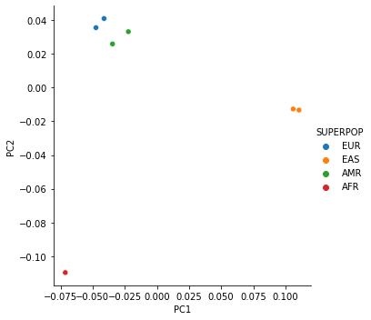
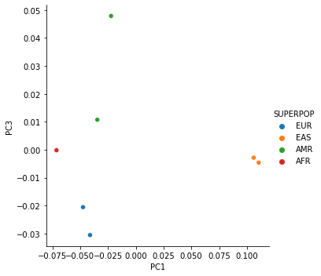
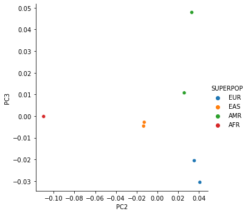

# PD MAMA Part 1: Meta-Analysis

`GP2 ❤️ Open Science 😍`

- **Module:** Multi-Ancestry Meta-Analysis Pipeline 
- **Authors:** Jonggeol Jeffrey Kim
- **Estimated Computation and Runtime:**
    - **Estimated Specifications:** 4 CPUs/28 GB
    - **Estimated Runtime:** 1 hour and 20 minutes
- **Date Last Updated:** 14-MAR-2023
    - **Update Description:** Re-ran analysis to get estimated runtime

---

### Quick Description: 

Performing a multi-ancestry GWAS meta-analysis using the summary statistics of the largest Parkinson's disease GWASs in European, Asian, Latin American, and African ancestries followed by fine-mapping the loci using MR-MEGA and PESCA. To combine ancestrally diverse association studies to increase power to detect novel PD-associated loci and improve fine-mapping resolution.

### Background/Motivation:

Genome-wide association studies (GWASs) are a popular, cost-effective method to identify and test common genetic variants across the genomes of many individuals to identify genotype-phenotype associations. GWASs have been useful to begin explaining the heritability of common quantitative traits and better understanding the genetic architecture of complex diseases. Genetic variations found significantly in individuals with the disease compared to those without, those variants are then "associated" with disease.

Traditionally, due to lack of data collection in other ethnicities, GWASs have been conducted in European populations to focus on limiting population stratification effects on studies. Multi-ancestry studies aim to leverage the natural differences in linkage disequilibrium across diverse populations, the knowledge known about one population, and assess if those variants replicate across populations populations while increasing statistical power.

Additionally, multi-ancestry GWASs for the identification of SNPs associated with disease risk in mixed populations, allow for fine-mapping of functional variants, and prioritization of candidate genes.

Studies involved:

* European: **Identification of novel risk loci, causal insights, and heritable risk for Parkinson's disease: a meta-analysis of genome-wide association studies.** *Nalls et al. 2019* https://doi.org/10.1016/S1474-4422(19)30320-5
* Finnish European: **FinnGen Release 4, Parkinson's Disease (more controls excluded) G6_PARKINSON_EXMORE**
* Latin American: **Characterizing the Genetic Architecture of Parkinson's Disease in Latinos.** *Loesch et al. 2021* https://doi.org/10.1002/ana.26153
* Asian: **Identification of Risk Loci for Parkinson Disease in Asians and Comparison of Risk Between Asians and Europeans: A Genome-Wide Association Study.** *Foo et al. 2020* https://doi.org/10.1001/jamaneurol.2020.0428

23andMe has also contributed datasets from East Asian, Latin American, and African ancestries. In total, we have 7 different datasets from 4 different ancestries.

### Workflow Summary:
1. Meta-analysis `<- You are here!`
2. Fine-mapping
3. Functional mapping and annotation

---

### Table of Content:

#### [0. Getting started](#0)
#### [1. Prepare pipeline](#1)
#### [2. Determine number of PCs for MR-MEGA](#2)
#### [3. Run meta-analyses](#3)
#### [4. Compress and upload results](#4)

# Getting Started

Here we will set up the workspace with necessary software and python packages.

## Load python packages


```python
# this is just for estimating runtime
import timeit
start = timeit.default_timer()
```


```python
import os
import sys
import numpy as np
import pandas as pd
import time
from scipy.stats import chi2
import seaborn as sns
```

## Download input datasets


We have already performed the following harmonization on the data:

1. Liftover hg38 datasets to hg19
2. Assigned SNP names to CHR:BP
3. Add odds ratio + 95% confidence internal
4. If allele frequency is missing, impute it using 1000 Genomes. This was only done on the Foo et al. 2020 east asian data.

The final format contains the following columns:

* MARKERNAME: Variant name in chromosome:bp format
* CHROMOSOME: Chromosome number in hg19
* POSITION: Basepair position in hg19
* NEA: Not effect allele
* EA: Effect allele
* EAF: Effect allele frequency
* BETA: Log odds ratio
* OR: Odds ratio
* SE: Standard error in log odds ratio
* OR_95U/95L: Upper and lower confidence intervals
* P: P value of association
* N: Total sample size
* NMISS: Total effective sample size


```bash
%%bash
mkdir data/
gsutil cp gs://fc-12d0d22f-3861-4641-8236-1dbe3a3c4e9d/summary_stats/1a_processed/{23AFR,23AMR,23EAS,AMR,EAS,EUR,FINN}.final.txt.gz data/
```

    mkdir: cannot create directory ‘data/’: File exists
    Copying gs://fc-12d0d22f-3861-4641-8236-1dbe3a3c4e9d/summary_stats/1a_processed/23AFR.final.txt.gz...
    Copying gs://fc-12d0d22f-3861-4641-8236-1dbe3a3c4e9d/summary_stats/1a_processed/23AMR.final.txt.gz...
    Copying gs://fc-12d0d22f-3861-4641-8236-1dbe3a3c4e9d/summary_stats/1a_processed/23EAS.final.txt.gz...
    Copying gs://fc-12d0d22f-3861-4641-8236-1dbe3a3c4e9d/summary_stats/1a_processed/AMR.final.txt.gz...
    - [4 files][  3.7 GiB/  3.7 GiB]  129.2 MiB/s                                   
    ==> NOTE: You are performing a sequence of gsutil operations that may
    run significantly faster if you instead use gsutil -m cp ... Please
    see the -m section under "gsutil help options" for further information
    about when gsutil -m can be advantageous.
    
    Copying gs://fc-12d0d22f-3861-4641-8236-1dbe3a3c4e9d/summary_stats/1a_processed/EAS.final.txt.gz...
    Copying gs://fc-12d0d22f-3861-4641-8236-1dbe3a3c4e9d/summary_stats/1a_processed/EUR.final.txt.gz...
    Copying gs://fc-12d0d22f-3861-4641-8236-1dbe3a3c4e9d/summary_stats/1a_processed/FINN.final.txt.gz...
    | [7 files][  4.8 GiB/  4.8 GiB]  105.5 MiB/s                                   
    Operation completed over 7 objects/4.8 GiB.                                      


```python
!zcat data/FINN.final.txt.gz | head 
```

    MARKERNAME	CHROMOSOME	POSITION	NEA	EA	EAF	BETA	OR	SE	OR_95U	OR_95L	P	N	NMISS
    chr1:108391	1	108391	A	G	0.002002	0.1917	1.2113070703295323	0.5919	3.864467895549229	0.37968094399753904	0.746	176899	6291.050689941718
    chr1:115637	1	115637	G	A	0.002462	0.0981	1.1030730869020164	0.5148	3.025595706912474	0.40215889792136816	0.8489	176899	6291.050689941718
    chr15:102517406	15	102517406	C	T	0.0016	-0.6996	0.49678397764504784	0.5817	1.5535334785172579	0.1588599948810783	0.2291	176899	6291.050689941718
    chr5:180743408	5	180743408	G	C	0.002315	-0.2848	0.7521646722115344	0.4707	1.8922602234624073	0.2989819725153275	0.5452	176899	6291.050689941718
    chr1:528642	1	528642	G	A	0.003457	0.4152	1.5146736451296208	0.4131	3.4037439923667003	0.6740331400937759	0.3148	176899	6291.050689941718
    chr1:544743	1	544743	C	T	0.003	-0.3847	0.6806548020187899	0.3833	1.442774505881074	0.321111135262482	0.3155	176899	6291.050689941718
    chr1:546344	1	546344	G	A	0.0018920000000000002	0.0358	1.0364485360533604	0.5722	3.181370249333881	0.3376612854514738	0.9502	176899	6291.050689941718
    chr1:558769	1	558769	G	T	0.001415	0.078	1.081122658670083	0.6528	3.886418346704813	0.3007463682032288	0.9048	176899	6291.050689941718
    chr1:565987	1	565987	C	T	0.003425	-0.1323	0.8760781322122511	0.3862	1.8675959209519437	0.41096303816582164	0.732	176899	6291.050689941718
    
    gzip: stdout: Broken pipe


```python
!gsutil cp gs://fc-12d0d22f-3861-4641-8236-1dbe3a3c4e9d/summary_stats/1a_processed/EUR.final.no23.txt.gz data/
```

    Copying gs://fc-12d0d22f-3861-4641-8236-1dbe3a3c4e9d/summary_stats/1a_processed/EUR.final.no23.txt.gz...
    | [1 files][326.4 MiB/326.4 MiB]                                                
    Operation completed over 1 objects/326.4 MiB.                                    


## Meta-analysis softwares

We will install MR-MEGA and PLINK 1.9.

### MR-MEGA

Version 0.2 as of 11-FEB-2022


```bash
%%bash
if test -e ~/bin/MR-MEGA; then
echo "MR-MEGA is already installed in ~/bin"
else
echo "MR-MEGA is not installed"

# Download MR-MEGA
readonly MR_MEGA_URL="https://tools.gi.ut.ee/tools/MR-MEGA_v0.2.zip"
readonly MR_MEGA_ZIP="$(basename ${MR_MEGA_URL})"
readonly MR_MEGA_FILE="${MR_MEGA_ZIP%.zip}"

mkdir -p ~/bin/"${MR_MEGA_FILE}"
cd ~/bin/"${MR_MEGA_FILE}"
# echo ${MR_MEGA_FILE}
curl -O "${MR_MEGA_URL}"
# echo $(ls)
# echo ${MR_MEGA_ZIP}
unzip "${MR_MEGA_ZIP}"
make
cd ..
ln -s "${MR_MEGA_FILE}"/MR-MEGA MR-MEGA
echo "MR-MEGA is now installed."
fi
```

    MR-MEGA is already installed in ~/bin


### PLINK 1.9


```bash
%%bash
# Install Plink1
set -o errexit
set -o nounset
set -o xtrace

mkdir -p ~/bin

if test -e ~/bin/plink; then
echo "Plink is already installed in ~/bin"
else
echo "Plink is not installed"

# Download Plink 1.9
readonly PLINK_URL="http://s3.amazonaws.com/plink1-assets/plink_linux_x86_64_20201019.zip"
readonly PLINK_ZIP="$(basename ${PLINK_URL})"
readonly PLINK_FILE="${PLINK_ZIP%.zip}"

mkdir -p ~/bin/"${PLINK_FILE}"
cd ~/bin/"${PLINK_FILE}"
# echo ${PLINK_FILE}
curl -O "${PLINK_URL}"
# echo $(ls)
# echo ${PLINK_ZIP}
unzip "${PLINK_ZIP}"
cd ..
ln -s "${PLINK_FILE}"/plink plink
echo "Plink is now installed."
fi
```

    Plink is already installed in ~/bin


    + mkdir -p /home/jupyter/bin
    + test -e /home/jupyter/bin/plink
    + echo 'Plink is already installed in ~/bin'


## Functions for running MR-MEGA/PLINK

3 functions:

1. Running MR-MEGA
2. Running PLINK 1.9 meta-analysis
3. Adding standard error to PLINK 1.9 results


```python
def mr_mega(file, output, beta=False, custom_columns=None, gc=False, gco=False, recalc_P=True, numPCs='auto', onlyMaxN=False):
    """
    Run MR-MEGA
        Arguments:
            file : str or list
                path to either an MR-MEGA compatible'.in' file with all cohorts or a list of files.
                If a list of files, '.in' file will be automatically generated.
            output : str
                path and name of desired output
            beta : bool, default False
                if the cohort phenotypes are quantitative and uses 'beta' and 'se' columns
            custom_columns : list
                list of columns length of 9 (beta) or 10 (odds ratio). Only required if 
                columns in the cohorts are not in MR-MEGA required format
                Must be in the following order:
                    MARKERNAME, EA, NEA, EAF, N, CHROMOSOME, POSITION, OR, OR_95L, OR_95U
                If quantitative (i.e. `beta`=True), replace OR, OR_95L, and OR_95U with:
                    BETA, SE
            gc : bool, default False
                genomic control for input
            gco : bool, default False
                genomic control for output
            recalc_P : bool, default True
                Recalculate P value from MR-MEGA. Due to limitations of C++ library, MR-MEGA
                can only calculate p-values down to 1e-14. This argument recalculates this using
                chisq value and df.
            numPCs : str or int, default 'auto'
                Number of PCs. 1 at minimum. When set to 'auto' (default), it automatically uses the
                max number of PCs (number of studies - 3).
            onlyMaxN : bool, default False
                only keep SNPs that are found in all studies. Even when set to false, it will still
                filter out SNPs with number of studies < 3+numPCs as they will output NA.
    """
    if isinstance(file, list):
        file_name = "mr_mega_run" + time.strftime("%Y%m%d-%H%M%S") + ".in"
        print("List of files detected, generating " + file_name)
        echo_command = "echo '" + "\n".join(file) + "' > " + file_name
        print(f'Executing: {echo_command}', file=sys.stderr)
        !$echo_command
        file = file_name
    num_studies = sum(1 for line in open(file))
    if numPCs == "auto":
        numPCs = num_studies-3
    print("Number of studies = " + str(num_studies))
    print("Number of PCs will be " + str(numPCs))
    beta_arg = ""
    gc_arg = ""
    gco_arg = ""
    column_arg = ""
    if beta:
        print("Set to quantitative phenotype (beta)")
        beta_arg = " --qt"        
    if gc:
        print("Genomic control on inputs on")
        gc_arg = " --gc"
    if gco:
        print("Genomic control on outputs on")
        gco_arg = " --gco"
    if not custom_columns==None:
        print("Custom columns detected.")
        marker_arg = " --name_marker "+columns[0]
        ea_arg = " --name_ea "+columns[1]
        nea_arg = " --name_nea "+columns[2]
        eaf_arg = " --name_eaf "+columns[3]
        n_arg = " --name_n "+columns[4]
        chr_arg = " --name_chr "+columns[5]
        pos_arg = " --name_pos "+columns[6]
        if beta:
            or_arg = " --name_beta "+columns[7]
            or_95l_arg = " --name_se "+columns[8]
            or_95u_arg = ""
        else:
            or_arg = " --name_or "+columns[7]
            or_95l_arg = " --name_or_95l "+columns[8]
            or_95u_arg = " --name_or_95u "+columns[9]
        column_arg = " --no_std_names" + pos_arg + chr_arg + n_arg + or_95u_arg + or_95l_arg + or_arg + eaf_arg + nea_arg + ea_arg + marker_arg
    command = "~/bin/MR-MEGA -i " + file + " --pc " + str(numPCs) + beta_arg + gc_arg + gco_arg + column_arg + " -o MR-MEGA_initres"
    print(f'Executing: {command}', file=sys.stderr)
    !$command
    print("Cleaning up NAs and low cohort count variants")
    MAMA_result = pd.read_csv(
        "MR-MEGA_initres.result",
        delim_whitespace=True,
        dtype={
            "MarkerName":str,
            "Chromosome":np.int64,
            "Position":np.int64,
            "EA":str,
            "NEA":str,
            "EAF":np.float64,
            "Nsample":np.float64,
            "Ncohort":np.float64,
            "Effects":str,
            "chisq_association":np.float64,
            "ndf_association":np.float64,
            "P-value_association":np.float64,
            "chisq_ancestry_het":np.float64,
            "ndf_ancestry_het":np.float64,
            "P-value_ancestry_het":np.float64,
            "chisq_residual_het":np.float64,
            "ndf_residual_het":np.float64,
            "P-value_residual_het":np.float64,
            "lnBF":np.float64,
            "Comments":str
        }
    )
    if onlyMaxN==True:
        cohort_filter =  MAMA_result['Ncohort']==num_studies
    else:
        cohort_filter =  MAMA_result['Ncohort']>=numPCs+3
    MAMA_result = MAMA_result[cohort_filter]
    print("Recalculating P values")
    MAMA_result['P-value_association'] = chi2.sf(MAMA_result['chisq_association'], MAMA_result['ndf_association'])
    MAMA_result['P-value_ancestry_het'] = chi2.sf(MAMA_result['chisq_ancestry_het'], MAMA_result['ndf_ancestry_het'])
    MAMA_result['P-value_residual_het'] = chi2.sf(MAMA_result['chisq_residual_het'], MAMA_result['ndf_residual_het'])
    print("Writing final results...")
    MAMA_result.dropna(subset=["P-value_association"]).to_csv(output+".MR-MEGA.tsv", sep="\t", index=False)
    print("Removing initial MR-MEGA results, adding MR-MEGA log")
    os.remove("MR-MEGA_initres.result")
    os.rename("MR-MEGA_initres.log", output+"_MR_MEGA.log")
```


```python
def PLINK_meta_analysis(file, output, column_arguments=None, misc_arguments=None):
    """
    Run PLINK meta analysis
        Arguments:
            file : list
                list of files for meta-analysis
            output : str
                path and name of desired output
            column_arguments : list, default None
                list of columns length of 8. Only required if columns in the cohorts are not in
                default PLINK format
                Must be in the following order:
                    SNP, A1, A2, CHR, BP, SE, P, NMISS
                    (P and NMISS only if misc_arguments contain "weighted-z")
            misc_arguments : str, default None
                Additional PLINK arguments to pass to PLINK.
                e.g. " + qt study weighted-z"
    """
    column_arg = ""
    if misc_arguments==None:
        misc_arguments = ""
    if not column_arguments==None:
        print("Custom columns detected.")
        snp_field = " --meta-analysis-snp-field " +  column_arguments[0]
        a1_field = " --meta-analysis-a1-field " +  column_arguments[1]
        a2_field = " --meta-analysis-a2-field " +  column_arguments[2]
        chr_field = " --meta-analysis-chr-field " +  column_arguments[3]
        bp_field = " --meta-analysis-bp-field " +  column_arguments[4]
        se_field = " --meta-analysis-se-field " +  column_arguments[5]
        if "weighted-z" in misc_arguments:
            p_field = " --meta-analysis-p-field " +  column_arguments[6]
            ess_field = " --meta-analysis-ess-field " +  column_arguments[7]
        else:
            p_field = ""
            ess_field = ""
        column_arg = snp_field+a1_field+a2_field+p_field+chr_field+bp_field+se_field+ess_field
    command = "~/bin/plink --meta-analysis " + " ".join(file) + " " + misc_arguments + " " + column_arg + " -out " + output+".PLINK"
    print(f'Executing: {command}', file=sys.stderr)
    !$command
```


```python
def addSE_PLINK_meta(file, output=None):
    """
    Generates PLINK Meta-analysis result with standard error columns
        if output is given, outputs with that specific path/name.
        Otherwise, outputs in same directory with same name + "wSE.tsv"
    """
    if output==None:
        output=file.replace(".meta", ".wSE.tsv")
    print("Output name: ", output)
    print("Reading file ", file)
    PLINK_RES = pd.read_csv(file, delim_whitespace=True, engine='c')
    print("Calculating Z-score (FE)")
    PLINK_RES['Z'] = norm.ppf(PLINK_RES['P']/2)
    print("Calculating SE (FE)")
    PLINK_RES['SE'] = PLINK_RES['BETA'].abs()/plink_dis['Z']
    print("Calculating Z-score (RE)")
    PLINK_RES['Z'] = norm.ppf(PLINK_RES['P(R)']/2)
    print("Calculating SE (RE)")
    PLINK_RES['SE(R)'] = PLINK_RES['BETA(R)'].abs()/plink_dis['Z']
    print("Dropping Z-scores and generating output")
    PLINK_RES.drop(columns=['Z']).to_csv(output, sep = '\t', index=False)
```

# Prepare Pipeline

To run this pipeline, set up the following variables:

PLINK meta-analysis specific:

* `MEGA_COLUMNS`: Column names for the MR-MEGA formatted files. See the `PLINK_meta_analysis` function `column_arguments` argument for details.
* `PLINK_MISC_ARG`: Additional arguments for PLINK. See the `PLINK_meta_analysis` function `misc_arguments` argument for details.

Input lists:

* `JOINT_COHORT_LIST`: full meta-analysis including 23andMe datasets
* `JOINT_no23_COHORT_LIST`: meta-analysis without 23andMe datasets for public release


## Method specific variables


```python
PLINK_COLUMNS_MEGAINPUT=["MARKERNAME", "EA", "NEA", "CHROMOSOME", "POSITION", "SE"]
PLINK_MISC_ARG='+ qt'#to output regression beta
```

## Individual cohorts


```python
# list dataset names here
EUR1_NAME='data/EUR.final.txt.gz'
EUR1_no23_NAME='data/EUR.final.no23.txt.gz'
EAS1_NAME='data/EAS.final.txt.gz'
AMR1_NAME='data/AMR.final.txt.gz'
EUR2_NAME='data/FINN.final.txt.gz'
AFR_NAME='data/23AFR.final.txt.gz'
EAS2_NAME='data/23EAS.final.txt.gz'
AMR2_NAME='data/23AMR.final.txt.gz'
```

## Inputs + Outputs


```python
JOINT_no23_COHORT_LIST=[
    EUR1_no23_NAME,
    EAS1_NAME,
    AMR1_NAME,
    EUR2_NAME
]
JOINT_COHORT_LIST = [
    EUR1_NAME,
    EAS1_NAME,
    AMR1_NAME,
    EUR2_NAME,
    AFR_NAME,
    EAS2_NAME,
    AMR2_NAME
]
JOINT_COHORT_OUTPUT="output/PD_MAMA"
JOINT_no23_COHORT_OUTPUT="output/PD_MAMA.no23"
```


```python
os.makedirs('output', exist_ok=True)
```

# Determine number of PCs for MR-MEGA

First, we need to run MR-MEGA with all datasets and max PCs to see how many is necessary for the meta-analysis. Too many PCs may reduce the power too much without contributing to the model.


```python
mr_mega(
    JOINT_COHORT_LIST,
    "output/PD_MAMA.maxPCs",
    onlyMaxN=False,
    recalc_P=False
)
```

    List of files detected, generating mr_mega_run20230314-185346.in


    Executing: echo 'data/EUR.final.txt.gz
    data/EAS.final.txt.gz
    data/AMR.final.txt.gz
    data/FINN.final.txt.gz
    data/23AFR.final.txt.gz
    data/23EAS.final.txt.gz
    data/23AMR.final.txt.gz' > mr_mega_run20230314-185346.in


    Number of studies = 7
    Number of PCs will be 4


    Executing: ~/bin/MR-MEGA -i mr_mega_run20230314-185346.in --pc 4 -o MR-MEGA_initres


    ###################
    # MR-MEGA v.0.2
    ###################
    
    Using following command line options:
    Input file: mr_mega_run20230314-185346.in
    Output result file: MR-MEGA_initres.result
    Output log file: MR-MEGA_initres.log
    Number of PC-s in regression: 4
    Binary trait analysis (expecting columns OR, OR_95L, OR_95U)
    P-value threshold for showing cohort effect direction: 1
    No column filters set
    Column names:
    	Marker name: MARKERNAME
    	Effect allele: EA
    	Other allele: NEA
    	Effect allele frequency: EAF
    	Effect (OR): OR
    	Upper CI of effect: OR_95U
    	Lower CI of effect: OR_95L
    	Strand: STRAND
    	Sample size: N
    	Chromosome: CHROMOSOME
    	Position: POSITION
    Reading cohort list file...
    Processing files...
    Reading file data/EUR.final.txt.gz
    	Marker problems:
    	Marker filtering:
    Lambda: 1.17034
    Reading file data/EAS.final.txt.gz
    	Marker problems:
    	EXAMPLE: Alleles dont match with previous cohorts: chr1:41764310 (T,C vs. (previous) A,C)
    	EXAMPLE: Alleles dont match with previous cohorts: chr1:240238588 (G,T vs. (previous) T,C)
    	EXAMPLE: Alleles dont match with previous cohorts: chr1:244273968 (T,G vs. (previous) A,G)
    	EXAMPLE: Alleles dont match with previous cohorts: chr2:20954889 (G,T vs. (previous) T,C)
    	EXAMPLE: Alleles dont match with previous cohorts: chr2:162138329 (T,C vs. (previous) A,C)
    	Altogether 43 similar errors
    	Marker filtering:
    Lambda: 1.09008
    Reading file data/AMR.final.txt.gz
    	Marker problems:
    	EXAMPLE: Unvalid chromosome number: chrUn_gl000235:11325 (Un_gl000235)
    	EXAMPLE: Unvalid chromosome number: chrUn_gl000211:94654 (Un_gl000211)
    	EXAMPLE: Unvalid chromosome number: chrUn_gl000211:94665 (Un_gl000211)
    	EXAMPLE: Unvalid chromosome number: chrUn_gl000212:10131 (Un_gl000212)
    	EXAMPLE: Unvalid chromosome number: chrUn_gl000212:81494 (Un_gl000212)
    	Altogether 9 similar errors
    	EXAMPLE: Alleles dont match with previous cohorts: chr1:1602571 (T,C vs. (previous) A,C)
    	EXAMPLE: Alleles dont match with previous cohorts: chr1:2248383 (C,G vs. (previous) T,G)
    	EXAMPLE: Alleles dont match with previous cohorts: chr1:2468427 (C,CGT vs. (previous) T,C)
    	EXAMPLE: Alleles dont match with previous cohorts: chr1:3089168 (G,T vs. (previous) C,T)
    	EXAMPLE: Alleles dont match with previous cohorts: chr1:4269638 (GT,G vs. (previous) A,G)
    	Altogether 3650 similar errors
    	Marker filtering:
    Lambda: 1.01522
    Reading file data/FINN.final.txt.gz
    	Marker problems:
    	EXAMPLE: Unvalid chromosome number: chrUn_gl000212:164179 (Un_gl000212)
    	EXAMPLE: Unvalid chromosome number: chrUn_gl000212:153112 (Un_gl000212)
    	EXAMPLE: Unvalid chromosome number: chrUn_gl000212:143415 (Un_gl000212)
    	EXAMPLE: Unvalid chromosome number: chrUn_gl000212:143138 (Un_gl000212)
    	EXAMPLE: Unvalid chromosome number: chrUn_gl000212:137398 (Un_gl000212)
    	Altogether 781 similar errors
    	EXAMPLE: Alleles dont match with previous cohorts: chr1:724137 (TAATGGAATGGAATGGAATGGAATGGAATGGAATGGAATGGAATGG,TAATGGAATGGAATGGAATGGAATGG vs. (previous) TAATGGAATGGAATGGAATGGAATGGAATGG,TAATGGAATGGAATGGAATGGAATGG)
    	EXAMPLE: Alleles dont match with previous cohorts: chr1:724137 (TAATGGAATGGAATGGAATGG,TAATGGAATGGAATGGAATGGAATGG vs. (previous) TAATGGAATGGAATGGAATGGAATGGAATGG,TAATGGAATGGAATGGAATGGAATGG)
    	EXAMPLE: Alleles dont match with previous cohorts: chr1:724137 (T,TAATGGAATGGAATGGAATGGAATGG vs. (previous) TAATGGAATGGAATGGAATGGAATGGAATGG,TAATGGAATGGAATGGAATGGAATGG)
    	EXAMPLE: Alleles dont match with previous cohorts: chr1:726481 (TGG,T vs. (previous) G,T)
    	EXAMPLE: Alleles dont match with previous cohorts: chr1:768116 (AGTTTTGTTTTGTTTTGTTTTGTTTTGTTTT,AGTTTTGTTTTGTTTTGTTTT vs. (previous) AGTTTTGTTTTGTTTTGTTTTGTTTT,AGTTTTGTTTTGTTTTGTTTT)
    	Altogether 82382 similar errors
    	Marker filtering:
    Lambda: 1.0129
    Reading file data/23AFR.final.txt.gz
    	Marker problems:
    	EXAMPLE: Unvalid chromosome number: chrUn_gl000211:39416 (Un_gl000211)
    	EXAMPLE: Unvalid chromosome number: chrUn_gl000211:43594 (Un_gl000211)
    	EXAMPLE: Unvalid chromosome number: chrUn_gl000211:44520 (Un_gl000211)
    	EXAMPLE: Unvalid chromosome number: chrUn_gl000211:44757 (Un_gl000211)
    	EXAMPLE: Unvalid chromosome number: chrUn_gl000211:45347 (Un_gl000211)
    	Altogether 222 similar errors
    	EXAMPLE: Alleles dont match with previous cohorts: chr1:665401 (T,C vs. (previous) C,A)
    	EXAMPLE: Alleles dont match with previous cohorts: chr1:706330 (I,D vs. (previous) AG,A)
    	EXAMPLE: Alleles dont match with previous cohorts: chr1:706332 (G,C vs. (previous) T,G)
    	EXAMPLE: Alleles dont match with previous cohorts: chr1:714059 (C,A vs. (previous) I,D)
    	EXAMPLE: Alleles dont match with previous cohorts: chr1:720968 (G,C vs. (previous) T,G)
    	Altogether 715323 similar errors
    	Marker filtering:
    Lambda: 0.908227
    Reading file data/23EAS.final.txt.gz
    	Marker problems:
    	EXAMPLE: Unvalid chromosome number: chrUn_gl000211:7925 (Un_gl000211)
    	EXAMPLE: Unvalid chromosome number: chrUn_gl000211:11694 (Un_gl000211)
    	EXAMPLE: Unvalid chromosome number: chrUn_gl000211:43665 (Un_gl000211)
    	EXAMPLE: Unvalid chromosome number: chrUn_gl000211:45693 (Un_gl000211)
    	EXAMPLE: Unvalid chromosome number: chrUn_gl000211:45715 (Un_gl000211)
    	Altogether 161 similar errors
    	EXAMPLE: Alleles dont match with previous cohorts: chr1:710704 (G,A vs. (previous) I,D)
    	EXAMPLE: Alleles dont match with previous cohorts: chr1:741068 (G,C vs. (previous) T,C)
    	EXAMPLE: Alleles dont match with previous cohorts: chr1:743076 (I,D vs. (previous) CA,C)
    	EXAMPLE: Alleles dont match with previous cohorts: chr1:774785 (G,C vs. (previous) G,A)
    	EXAMPLE: Alleles dont match with previous cohorts: chr1:804978 (I,D vs. (previous) TA,T)
    	Altogether 371497 similar errors
    	Marker filtering:
    Lambda: 0.98872
    Reading file data/23AMR.final.txt.gz
    	Marker problems:
    	EXAMPLE: Unvalid chromosome number: chrUn_gl000211:27680 (Un_gl000211)
    	EXAMPLE: Unvalid chromosome number: chrUn_gl000211:44520 (Un_gl000211)
    	EXAMPLE: Unvalid chromosome number: chrUn_gl000211:45364 (Un_gl000211)
    	EXAMPLE: Unvalid chromosome number: chrUn_gl000211:49316 (Un_gl000211)
    	EXAMPLE: Unvalid chromosome number: chrUn_gl000211:50019 (Un_gl000211)
    	Altogether 160 similar errors
    	EXAMPLE: Alleles dont match with previous cohorts: chr1:665401 (T,C vs. (previous) C,A)
    	EXAMPLE: Alleles dont match with previous cohorts: chr1:706332 (G,C vs. (previous) T,G)
    	EXAMPLE: Alleles dont match with previous cohorts: chr1:720968 (G,C vs. (previous) T,G)
    	EXAMPLE: Alleles dont match with previous cohorts: chr1:726481 (I,D vs. (previous) G,T)
    	EXAMPLE: Alleles dont match with previous cohorts: chr1:743076 (I,D vs. (previous) CA,C)
    	Altogether 579704 similar errors
    	Marker filtering:
    Lambda: 1.03239
    Calculating the number of markers present in all cohorts and with MAF>1%...
    Altogether 3273327 good markers.
    Selected 2699 independent variants for EAF correlation calculation
    Calculating distance matrix...
    Calculating MDS between cohorts...
    Preparing output...
    Cleaning up NAs and low cohort count variants
    Recalculating P values
    Writing final results...
    Removing initial MR-MEGA results, adding MR-MEGA log


```python
!cat output/PD_MAMA.maxPCs_MR_MEGA.log
```

    ###################
    # MR-MEGA v.0.2
    ###################
    
    Using following command line options:
    Input file: mr_mega_run20230314-185346.in
    Output result file: MR-MEGA_initres.result
    Output log file: MR-MEGA_initres.log
    Number of PC-s in regression: 4
    Binary trait analysis (expecting columns OR, OR_95L, OR_95U)
    P-value threshold for showing cohort effect direction: 1
    No column filters set
    Column names:
    	Marker name: MARKERNAME
    	Effect allele: EA
    	Other allele: NEA
    	Effect allele frequency: EAF
    	Effect (OR): OR
    	Upper CI of effect: OR_95U
    	Lower CI of effect: OR_95L
    	Strand: STRAND
    	Sample size: N
    	Chromosome: CHROMOSOME
    	Position: POSITION
    Cohorts list:
    data/EUR.final.txt.gz
    data/EAS.final.txt.gz
    data/AMR.final.txt.gz
    data/FINN.final.txt.gz
    data/23AFR.final.txt.gz
    data/23EAS.final.txt.gz
    data/23AMR.final.txt.gz
    Lambda:1.17034
    Lambda:1.09008
    Lambda:1.01522
    Lambda:1.0129
    Lambda:0.908227
    Lambda:0.98872
    Lambda:1.03239
    Principal components:
    PCs PC0 PC1 PC2 PC3
    data/EUR.final.txt.gz -0.047433 0.0355614 -0.020524 0.0200307
    data/EAS.final.txt.gz 0.110564 -0.0132927 -0.00458461 0.00103094
    data/AMR.final.txt.gz -0.0222109 0.0331738 0.0478752 -0.00671082
    data/FINN.final.txt.gz -0.0411192 0.0409792 -0.0305296 -0.0211662
    data/23AFR.final.txt.gz -0.0712782 -0.109662 -0.000161193 -0.00157295
    data/23EAS.final.txt.gz 0.106017 -0.0126698 -0.00282027 -4.01403e-05
    data/23AMR.final.txt.gz -0.0345402 0.0259098 0.0107444 0.00842837
    


## Plot the PCs


```python
!grep -n 'data/' output/PD_MAMA.maxPCs_MR_MEGA.log
```

    26:data/EUR.final.txt.gz
    27:data/EAS.final.txt.gz
    28:data/AMR.final.txt.gz
    29:data/FINN.final.txt.gz
    30:data/23AFR.final.txt.gz
    31:data/23EAS.final.txt.gz
    32:data/23AMR.final.txt.gz
    42:data/EUR.final.txt.gz -0.047433 0.0355614 -0.020524 0.0200307
    43:data/EAS.final.txt.gz 0.110564 -0.0132927 -0.00458461 0.00103094
    44:data/AMR.final.txt.gz -0.0222109 0.0331738 0.0478752 -0.00671082
    45:data/FINN.final.txt.gz -0.0411192 0.0409792 -0.0305296 -0.0211662
    46:data/23AFR.final.txt.gz -0.0712782 -0.109662 -0.000161193 -0.00157295
    47:data/23EAS.final.txt.gz 0.106017 -0.0126698 -0.00282027 -4.01403e-05
    48:data/23AMR.final.txt.gz -0.0345402 0.0259098 0.0107444 0.00842837


```python
PCs = pd.read_csv(
    'output/PD_MAMA.maxPCs_MR_MEGA.log',
    delim_whitespace=True,
    skiprows=41,
    header=None,
    names=['FILE','PC1','PC2','PC3','PC4']
)
PCs['Datasets'] = PCs['FILE'].str.replace(
    r'data/(\w+)\..+',
    r'\1',
    regex=True
)
PCs
```


<div>
<style scoped>
    .dataframe tbody tr th:only-of-type {
        vertical-align: middle;
    }

    .dataframe tbody tr th {
        vertical-align: top;
    }

    .dataframe thead th {
        text-align: right;
    }
</style>
<table border="1" class="dataframe">
  <thead>
    <tr style="text-align: right;">
      <th></th>
      <th>FILE</th>
      <th>PC1</th>
      <th>PC2</th>
      <th>PC3</th>
      <th>PC4</th>
      <th>Datasets</th>
    </tr>
  </thead>
  <tbody>
    <tr>
      <th>0</th>
      <td>data/EUR.final.txt.gz</td>
      <td>-0.047433</td>
      <td>0.035561</td>
      <td>-0.020524</td>
      <td>0.020031</td>
      <td>EUR</td>
    </tr>
    <tr>
      <th>1</th>
      <td>data/EAS.final.txt.gz</td>
      <td>0.110564</td>
      <td>-0.013293</td>
      <td>-0.004585</td>
      <td>0.001031</td>
      <td>EAS</td>
    </tr>
    <tr>
      <th>2</th>
      <td>data/AMR.final.txt.gz</td>
      <td>-0.022211</td>
      <td>0.033174</td>
      <td>0.047875</td>
      <td>-0.006711</td>
      <td>AMR</td>
    </tr>
    <tr>
      <th>3</th>
      <td>data/FINN.final.txt.gz</td>
      <td>-0.041119</td>
      <td>0.040979</td>
      <td>-0.030530</td>
      <td>-0.021166</td>
      <td>FINN</td>
    </tr>
    <tr>
      <th>4</th>
      <td>data/23AFR.final.txt.gz</td>
      <td>-0.071278</td>
      <td>-0.109662</td>
      <td>-0.000161</td>
      <td>-0.001573</td>
      <td>23AFR</td>
    </tr>
    <tr>
      <th>5</th>
      <td>data/23EAS.final.txt.gz</td>
      <td>0.106017</td>
      <td>-0.012670</td>
      <td>-0.002820</td>
      <td>-0.000040</td>
      <td>23EAS</td>
    </tr>
    <tr>
      <th>6</th>
      <td>data/23AMR.final.txt.gz</td>
      <td>-0.034540</td>
      <td>0.025910</td>
      <td>0.010744</td>
      <td>0.008428</td>
      <td>23AMR</td>
    </tr>
  </tbody>
</table>
</div>


```python
PCs.loc[PCs['Datasets'].isin(['EUR','FINN']),'SUPERPOP']='EUR'
PCs.loc[PCs['Datasets'].isin(['EAS','23EAS']),'SUPERPOP']='EAS'
PCs.loc[PCs['Datasets'].isin(['AMR','23AMR']),'SUPERPOP']='AMR'
PCs.loc[PCs['Datasets'].isin(['23AFR']),'SUPERPOP']='AFR'
```


```python
# Apply the default theme
# sns.set_theme()

# PC1 vs PC2
sns.relplot(
    data=PCs,
    x="PC1", y="PC2",
    hue="SUPERPOP",
)
```


    <seaborn.axisgrid.FacetGrid at 0x7f48d44487d0>


    

    


Clearly we need more to separate EUR and AMR


```python
sns.relplot(
    data=PCs,
    x="PC1", y="PC3",
    hue="SUPERPOP",
)
```


    <seaborn.axisgrid.FacetGrid at 0x7f48d4223cd0>


    

    


```python
sns.relplot(
    data=PCs,
    x="PC2", y="PC3",
    hue="SUPERPOP",
)
```


    <seaborn.axisgrid.FacetGrid at 0x7f48d42a9e10>


    

    


Third PC seems to separate them pretty well. Let's use 3 PCs.

# Run meta-analysis

## Full meta-analysis


```python
mr_mega(
    JOINT_COHORT_LIST,
    JOINT_COHORT_OUTPUT,
    onlyMaxN=False,
    numPCs=3
)
```

    List of files detected, generating mr_mega_run20230314-190926.in


    Executing: echo 'data/EUR.final.txt.gz
    data/EAS.final.txt.gz
    data/AMR.final.txt.gz
    data/FINN.final.txt.gz
    data/23AFR.final.txt.gz
    data/23EAS.final.txt.gz
    data/23AMR.final.txt.gz' > mr_mega_run20230314-190926.in


    Number of studies = 7
    Number of PCs will be 3


    Executing: ~/bin/MR-MEGA -i mr_mega_run20230314-190926.in --pc 3 -o MR-MEGA_initres


    ###################
    # MR-MEGA v.0.2
    ###################
    
    Using following command line options:
    Input file: mr_mega_run20230314-190926.in
    Output result file: MR-MEGA_initres.result
    Output log file: MR-MEGA_initres.log
    Number of PC-s in regression: 3
    Binary trait analysis (expecting columns OR, OR_95L, OR_95U)
    P-value threshold for showing cohort effect direction: 1
    No column filters set
    Column names:
    	Marker name: MARKERNAME
    	Effect allele: EA
    	Other allele: NEA
    	Effect allele frequency: EAF
    	Effect (OR): OR
    	Upper CI of effect: OR_95U
    	Lower CI of effect: OR_95L
    	Strand: STRAND
    	Sample size: N
    	Chromosome: CHROMOSOME
    	Position: POSITION
    Reading cohort list file...
    Processing files...
    Reading file data/EUR.final.txt.gz
    	Marker problems:
    	Marker filtering:
    Lambda: 1.17034
    Reading file data/EAS.final.txt.gz
    	Marker problems:
    	EXAMPLE: Alleles dont match with previous cohorts: chr1:41764310 (T,C vs. (previous) A,C)
    	EXAMPLE: Alleles dont match with previous cohorts: chr1:240238588 (G,T vs. (previous) T,C)
    	EXAMPLE: Alleles dont match with previous cohorts: chr1:244273968 (T,G vs. (previous) A,G)
    	EXAMPLE: Alleles dont match with previous cohorts: chr2:20954889 (G,T vs. (previous) T,C)
    	EXAMPLE: Alleles dont match with previous cohorts: chr2:162138329 (T,C vs. (previous) A,C)
    	Altogether 43 similar errors
    	Marker filtering:
    Lambda: 1.09008
    Reading file data/AMR.final.txt.gz
    	Marker problems:
    	EXAMPLE: Unvalid chromosome number: chrUn_gl000235:11325 (Un_gl000235)
    	EXAMPLE: Unvalid chromosome number: chrUn_gl000211:94654 (Un_gl000211)
    	EXAMPLE: Unvalid chromosome number: chrUn_gl000211:94665 (Un_gl000211)
    	EXAMPLE: Unvalid chromosome number: chrUn_gl000212:10131 (Un_gl000212)
    	EXAMPLE: Unvalid chromosome number: chrUn_gl000212:81494 (Un_gl000212)
    	Altogether 9 similar errors
    	EXAMPLE: Alleles dont match with previous cohorts: chr1:1602571 (T,C vs. (previous) A,C)
    	EXAMPLE: Alleles dont match with previous cohorts: chr1:2248383 (C,G vs. (previous) T,G)
    	EXAMPLE: Alleles dont match with previous cohorts: chr1:2468427 (C,CGT vs. (previous) T,C)
    	EXAMPLE: Alleles dont match with previous cohorts: chr1:3089168 (G,T vs. (previous) C,T)
    	EXAMPLE: Alleles dont match with previous cohorts: chr1:4269638 (GT,G vs. (previous) A,G)
    	Altogether 3650 similar errors
    	Marker filtering:
    Lambda: 1.01522
    Reading file data/FINN.final.txt.gz
    	Marker problems:
    	EXAMPLE: Unvalid chromosome number: chrUn_gl000212:164179 (Un_gl000212)
    	EXAMPLE: Unvalid chromosome number: chrUn_gl000212:153112 (Un_gl000212)
    	EXAMPLE: Unvalid chromosome number: chrUn_gl000212:143415 (Un_gl000212)
    	EXAMPLE: Unvalid chromosome number: chrUn_gl000212:143138 (Un_gl000212)
    	EXAMPLE: Unvalid chromosome number: chrUn_gl000212:137398 (Un_gl000212)
    	Altogether 781 similar errors
    	EXAMPLE: Alleles dont match with previous cohorts: chr1:724137 (TAATGGAATGGAATGGAATGGAATGGAATGGAATGGAATGGAATGG,TAATGGAATGGAATGGAATGGAATGG vs. (previous) TAATGGAATGGAATGGAATGGAATGGAATGG,TAATGGAATGGAATGGAATGGAATGG)
    	EXAMPLE: Alleles dont match with previous cohorts: chr1:724137 (TAATGGAATGGAATGGAATGG,TAATGGAATGGAATGGAATGGAATGG vs. (previous) TAATGGAATGGAATGGAATGGAATGGAATGG,TAATGGAATGGAATGGAATGGAATGG)
    	EXAMPLE: Alleles dont match with previous cohorts: chr1:724137 (T,TAATGGAATGGAATGGAATGGAATGG vs. (previous) TAATGGAATGGAATGGAATGGAATGGAATGG,TAATGGAATGGAATGGAATGGAATGG)
    	EXAMPLE: Alleles dont match with previous cohorts: chr1:726481 (TGG,T vs. (previous) G,T)
    	EXAMPLE: Alleles dont match with previous cohorts: chr1:768116 (AGTTTTGTTTTGTTTTGTTTTGTTTTGTTTT,AGTTTTGTTTTGTTTTGTTTT vs. (previous) AGTTTTGTTTTGTTTTGTTTTGTTTT,AGTTTTGTTTTGTTTTGTTTT)
    	Altogether 82382 similar errors
    	Marker filtering:
    Lambda: 1.0129
    Reading file data/23AFR.final.txt.gz
    	Marker problems:
    	EXAMPLE: Unvalid chromosome number: chrUn_gl000211:39416 (Un_gl000211)
    	EXAMPLE: Unvalid chromosome number: chrUn_gl000211:43594 (Un_gl000211)
    	EXAMPLE: Unvalid chromosome number: chrUn_gl000211:44520 (Un_gl000211)
    	EXAMPLE: Unvalid chromosome number: chrUn_gl000211:44757 (Un_gl000211)
    	EXAMPLE: Unvalid chromosome number: chrUn_gl000211:45347 (Un_gl000211)
    	Altogether 222 similar errors
    	EXAMPLE: Alleles dont match with previous cohorts: chr1:665401 (T,C vs. (previous) C,A)
    	EXAMPLE: Alleles dont match with previous cohorts: chr1:706330 (I,D vs. (previous) AG,A)
    	EXAMPLE: Alleles dont match with previous cohorts: chr1:706332 (G,C vs. (previous) T,G)
    	EXAMPLE: Alleles dont match with previous cohorts: chr1:714059 (C,A vs. (previous) I,D)
    	EXAMPLE: Alleles dont match with previous cohorts: chr1:720968 (G,C vs. (previous) T,G)
    	Altogether 715323 similar errors
    	Marker filtering:
    Lambda: 0.908227
    Reading file data/23EAS.final.txt.gz
    	Marker problems:
    	EXAMPLE: Unvalid chromosome number: chrUn_gl000211:7925 (Un_gl000211)
    	EXAMPLE: Unvalid chromosome number: chrUn_gl000211:11694 (Un_gl000211)
    	EXAMPLE: Unvalid chromosome number: chrUn_gl000211:43665 (Un_gl000211)
    	EXAMPLE: Unvalid chromosome number: chrUn_gl000211:45693 (Un_gl000211)
    	EXAMPLE: Unvalid chromosome number: chrUn_gl000211:45715 (Un_gl000211)
    	Altogether 161 similar errors
    	EXAMPLE: Alleles dont match with previous cohorts: chr1:710704 (G,A vs. (previous) I,D)
    	EXAMPLE: Alleles dont match with previous cohorts: chr1:741068 (G,C vs. (previous) T,C)
    	EXAMPLE: Alleles dont match with previous cohorts: chr1:743076 (I,D vs. (previous) CA,C)
    	EXAMPLE: Alleles dont match with previous cohorts: chr1:774785 (G,C vs. (previous) G,A)
    	EXAMPLE: Alleles dont match with previous cohorts: chr1:804978 (I,D vs. (previous) TA,T)
    	Altogether 371497 similar errors
    	Marker filtering:
    Lambda: 0.98872
    Reading file data/23AMR.final.txt.gz
    	Marker problems:
    	EXAMPLE: Unvalid chromosome number: chrUn_gl000211:27680 (Un_gl000211)
    	EXAMPLE: Unvalid chromosome number: chrUn_gl000211:44520 (Un_gl000211)
    	EXAMPLE: Unvalid chromosome number: chrUn_gl000211:45364 (Un_gl000211)
    	EXAMPLE: Unvalid chromosome number: chrUn_gl000211:49316 (Un_gl000211)
    	EXAMPLE: Unvalid chromosome number: chrUn_gl000211:50019 (Un_gl000211)
    	Altogether 160 similar errors
    	EXAMPLE: Alleles dont match with previous cohorts: chr1:665401 (T,C vs. (previous) C,A)
    	EXAMPLE: Alleles dont match with previous cohorts: chr1:706332 (G,C vs. (previous) T,G)
    	EXAMPLE: Alleles dont match with previous cohorts: chr1:720968 (G,C vs. (previous) T,G)
    	EXAMPLE: Alleles dont match with previous cohorts: chr1:726481 (I,D vs. (previous) G,T)
    	EXAMPLE: Alleles dont match with previous cohorts: chr1:743076 (I,D vs. (previous) CA,C)
    	Altogether 579704 similar errors
    	Marker filtering:
    Lambda: 1.03239
    Calculating the number of markers present in all cohorts and with MAF>1%...
    Altogether 3273327 good markers.
    Selected 2699 independent variants for EAF correlation calculation
    Calculating distance matrix...
    Calculating MDS between cohorts...
    Preparing output...
    Cleaning up NAs and low cohort count variants
    Recalculating P values
    Writing final results...
    Removing initial MR-MEGA results, adding MR-MEGA log


```python
PLINK_meta_analysis(
    JOINT_COHORT_LIST,
    JOINT_COHORT_OUTPUT,
    column_arguments=PLINK_COLUMNS_MEGAINPUT,
    misc_arguments=PLINK_MISC_ARG
)
```

    Custom columns detected.


    Executing: ~/bin/plink --meta-analysis data/EUR.final.txt.gz data/EAS.final.txt.gz data/AMR.final.txt.gz data/FINN.final.txt.gz data/23AFR.final.txt.gz data/23EAS.final.txt.gz data/23AMR.final.txt.gz + qt  --meta-analysis-snp-field MARKERNAME --meta-analysis-a1-field EA --meta-analysis-a2-field NEA --meta-analysis-chr-field CHROMOSOME --meta-analysis-bp-field POSITION --meta-analysis-se-field SE -out output/PD_MAMA.PLINK


    PLINK v1.90b6.21 64-bit (19 Oct 2020)          www.cog-genomics.org/plink/1.9/
    (C) 2005-2020 Shaun Purcell, Christopher Chang   GNU General Public License v3
    Logging to output/PD_MAMA.PLINK.log.
    Options in effect:
      --meta-analysis data/EUR.final.txt.gz data/EAS.final.txt.gz data/AMR.final.txt.gz data/FINN.final.txt.gz data/23AFR.final.txt.gz data/23EAS.final.txt.gz data/23AMR.final.txt.gz + qt
      --meta-analysis-a1-field EA
      --meta-analysis-a2-field NEA
      --meta-analysis-bp-field POSITION
      --meta-analysis-chr-field CHROMOSOME
      --meta-analysis-se-field SE
      --meta-analysis-snp-field MARKERNAME
      --out output/PD_MAMA.PLINK
    
    26062 MB RAM detected; reserving 13031 MB for main workspace.
    --meta-analysis: 1246758 problematic lines; see output/PD_MAMA.PLINK.prob .
    --meta-analysis: 21315322 variants processed; results written to
    output/PD_MAMA.PLINK.meta .


## without 23andMe


```python
# can only have 1 PC due to number of datasets
mr_mega(
    JOINT_no23_COHORT_LIST,
    JOINT_no23_COHORT_OUTPUT
)
```

    List of files detected, generating mr_mega_run20230314-195348.in


    Executing: echo 'data/EUR.final.no23.txt.gz
    data/EAS.final.txt.gz
    data/AMR.final.txt.gz
    data/FINN.final.txt.gz' > mr_mega_run20230314-195348.in


    Number of studies = 4
    Number of PCs will be 1


    Executing: ~/bin/MR-MEGA -i mr_mega_run20230314-195348.in --pc 1 -o MR-MEGA_initres


    ###################
    # MR-MEGA v.0.2
    ###################
    
    Using following command line options:
    Input file: mr_mega_run20230314-195348.in
    Output result file: MR-MEGA_initres.result
    Output log file: MR-MEGA_initres.log
    Number of PC-s in regression: 1
    Binary trait analysis (expecting columns OR, OR_95L, OR_95U)
    P-value threshold for showing cohort effect direction: 1
    No column filters set
    Column names:
    	Marker name: MARKERNAME
    	Effect allele: EA
    	Other allele: NEA
    	Effect allele frequency: EAF
    	Effect (OR): OR
    	Upper CI of effect: OR_95U
    	Lower CI of effect: OR_95L
    	Strand: STRAND
    	Sample size: N
    	Chromosome: CHROMOSOME
    	Position: POSITION
    Reading cohort list file...
    Processing files...
    Reading file data/EUR.final.no23.txt.gz
    	Marker problems:
    	Marker filtering:
    Lambda: 1.06487
    Reading file data/EAS.final.txt.gz
    	Marker problems:
    	EXAMPLE: Alleles dont match with previous cohorts: chr1:17720088 (G,T vs. (previous) A,T)
    	EXAMPLE: Alleles dont match with previous cohorts: chr1:20200691 (G,A vs. (previous) A,C)
    	EXAMPLE: Alleles dont match with previous cohorts: chr1:22320635 (A,G vs. (previous) C,G)
    	EXAMPLE: Alleles dont match with previous cohorts: chr1:31869978 (C,G vs. (previous) A,G)
    	EXAMPLE: Alleles dont match with previous cohorts: chr1:37423534 (G,A vs. (previous) A,C)
    	Altogether 753 similar errors
    	Marker filtering:
    Lambda: 1.09008
    Reading file data/AMR.final.txt.gz
    	Marker problems:
    	EXAMPLE: Unvalid chromosome number: chrUn_gl000235:11325 (Un_gl000235)
    	EXAMPLE: Unvalid chromosome number: chrUn_gl000211:94654 (Un_gl000211)
    	EXAMPLE: Unvalid chromosome number: chrUn_gl000211:94665 (Un_gl000211)
    	EXAMPLE: Unvalid chromosome number: chrUn_gl000212:10131 (Un_gl000212)
    	EXAMPLE: Unvalid chromosome number: chrUn_gl000212:81494 (Un_gl000212)
    	Altogether 9 similar errors
    	EXAMPLE: Alleles dont match with previous cohorts: chr1:1288583 (G,C vs. (previous) A,C)
    	EXAMPLE: Alleles dont match with previous cohorts: chr1:1602571 (T,C vs. (previous) A,C)
    	EXAMPLE: Alleles dont match with previous cohorts: chr1:2248383 (C,G vs. (previous) T,G)
    	EXAMPLE: Alleles dont match with previous cohorts: chr1:2468427 (C,CGT vs. (previous) T,C)
    	EXAMPLE: Alleles dont match with previous cohorts: chr1:2507415 (T,G vs. (previous) A,G)
    	Altogether 5702 similar errors
    	Marker filtering:
    Lambda: 1.01522
    Reading file data/FINN.final.txt.gz
    	Marker problems:
    	EXAMPLE: Unvalid chromosome number: chrUn_gl000212:164179 (Un_gl000212)
    	EXAMPLE: Unvalid chromosome number: chrUn_gl000212:153112 (Un_gl000212)
    	EXAMPLE: Unvalid chromosome number: chrUn_gl000212:143415 (Un_gl000212)
    	EXAMPLE: Unvalid chromosome number: chrUn_gl000212:143138 (Un_gl000212)
    	EXAMPLE: Unvalid chromosome number: chrUn_gl000212:137398 (Un_gl000212)
    	Altogether 781 similar errors
    	EXAMPLE: Alleles dont match with previous cohorts: chr1:724137 (TAATGGAATGGAATGGAATGGAATGGAATGGAATGGAATGGAATGG,TAATGGAATGGAATGGAATGGAATGG vs. (previous) TAATGGAATGGAATGGAATGGAATGGAATGG,TAATGGAATGGAATGGAATGGAATGG)
    	EXAMPLE: Alleles dont match with previous cohorts: chr1:724137 (TAATGGAATGGAATGGAATGG,TAATGGAATGGAATGGAATGGAATGG vs. (previous) TAATGGAATGGAATGGAATGGAATGGAATGG,TAATGGAATGGAATGGAATGGAATGG)
    	EXAMPLE: Alleles dont match with previous cohorts: chr1:724137 (T,TAATGGAATGGAATGGAATGGAATGG vs. (previous) TAATGGAATGGAATGGAATGGAATGGAATGG,TAATGGAATGGAATGGAATGGAATGG)
    	EXAMPLE: Alleles dont match with previous cohorts: chr1:726481 (TGG,T vs. (previous) G,T)
    	EXAMPLE: Alleles dont match with previous cohorts: chr1:768116 (AGTTTTGTTTTGTTTTGTTTTGTTTTGTTTT,AGTTTTGTTTTGTTTTGTTTT vs. (previous) AGTTTTGTTTTGTTTTGTTTTGTTTT,AGTTTTGTTTTGTTTTGTTTT)
    	Altogether 83109 similar errors
    	Marker filtering:
    Lambda: 1.01292
    Calculating the number of markers present in all cohorts and with MAF>1%...
    Altogether 4178463 good markers.
    Selected 2700 independent variants for EAF correlation calculation
    Calculating distance matrix...
    Calculating MDS between cohorts...
    Preparing output...
    Analysis finished.
    Cleaning up NAs and low cohort count variants
    Recalculating P values
    Writing final results...
    Removing initial MR-MEGA results, adding MR-MEGA log


```python
PLINK_meta_analysis(
    JOINT_no23_COHORT_LIST,
    JOINT_no23_COHORT_OUTPUT,
    column_arguments=PLINK_COLUMNS_MEGAINPUT,
    misc_arguments=PLINK_MISC_ARG
)
```

    Custom columns detected.


    Executing: ~/bin/plink --meta-analysis data/EUR.final.no23.txt.gz data/EAS.final.txt.gz data/AMR.final.txt.gz data/FINN.final.txt.gz + qt  --meta-analysis-snp-field MARKERNAME --meta-analysis-a1-field EA --meta-analysis-a2-field NEA --meta-analysis-chr-field CHROMOSOME --meta-analysis-bp-field POSITION --meta-analysis-se-field SE -out output/PD_MAMA.no23.PLINK


    PLINK v1.90b6.21 64-bit (19 Oct 2020)          www.cog-genomics.org/plink/1.9/
    (C) 2005-2020 Shaun Purcell, Christopher Chang   GNU General Public License v3
    Logging to output/PD_MAMA.no23.PLINK.log.
    Options in effect:
      --meta-analysis data/EUR.final.no23.txt.gz data/EAS.final.txt.gz data/AMR.final.txt.gz data/FINN.final.txt.gz + qt
      --meta-analysis-a1-field EA
      --meta-analysis-a2-field NEA
      --meta-analysis-bp-field POSITION
      --meta-analysis-chr-field CHROMOSOME
      --meta-analysis-se-field SE
      --meta-analysis-snp-field MARKERNAME
      --out output/PD_MAMA.no23.PLINK
    
    26062 MB RAM detected; reserving 13031 MB for main workspace.
    --meta-analysis: 30736 problematic lines; see output/PD_MAMA.no23.PLINK.prob .
    --meta-analysis: 9019115 variants processed; results written to
    output/PD_MAMA.no23.PLINK.meta .


# Compress and upload results


```bash
%%bash
gzip output/PD_MAMA*
```


```python
# if checking runtime
stop = timeit.default_timer()

print('Time: ', stop - start)
```

    Time:  4881.996717147


```python
!gsutil -m cp output/PD_MAMA*.gz gs://fc-12d0d22f-3861-4641-8236-1dbe3a3c4e9d/results/meta_analysis/
```

    Copying file://output/PD_MAMA.maxPCs_MR_MEGA.log.gz [Content-Type=application/octet-stream]...
    Copying file://output/PD_MAMA.maxPCs.MR-MEGA.tsv.gz [Content-Type=text/tab-separated-values]...
    Copying file://output/PD_MAMA_MR_MEGA.log.gz [Content-Type=application/octet-stream]...
    Copying file://output/PD_MAMA.PLINK.meta.gz [Content-Type=application/octet-stream]...
    Copying file://output/PD_MAMA.no23.MR-MEGA.tsv.gz [Content-Type=text/tab-separated-values]...
    ==> NOTE: You are uploading one or more large file(s), which would run
    significantly faster if you enable parallel composite uploads. This
    feature can be enabled by editing the
    "parallel_composite_upload_threshold" value in your .boto
    configuration file. However, note that if you do this large files will
    be uploaded as `composite objects
    <https://cloud.google.com/storage/docs/composite-objects>`_,which
    means that any user who downloads such objects will need to have a
    compiled crcmod installed (see "gsutil help crcmod"). This is because
    without a compiled crcmod, computing checksums on composite objects is
    so slow that gsutil disables downloads of composite objects.
    
    Copying file://output/PD_MAMA.PLINK.prob.gz [Content-Type=application/octet-stream]...
    Copying file://output/PD_MAMA.MR-MEGA.tsv.gz [Content-Type=text/tab-separated-values]...
    Copying file://output/PD_MAMA.no23_MR_MEGA.log.gz [Content-Type=application/octet-stream]...
    Copying file://output/PD_MAMA.no23.PLINK.prob.gz [Content-Type=application/octet-stream]...
    Copying file://output/PD_MAMA.no23.PLINK.log.gz [Content-Type=application/octet-stream]...
    Copying file://output/PD_MAMA.PLINK.log.gz [Content-Type=application/octet-stream]...
    Copying file://output/PD_MAMA.no23.PLINK.meta.gz [Content-Type=application/octet-stream]...
    / [12/12 files][ 1003 MiB/ 1003 MiB] 100% Done                                  
    Operation completed over 12 objects/1003.6 MiB.                                  


```python

```
